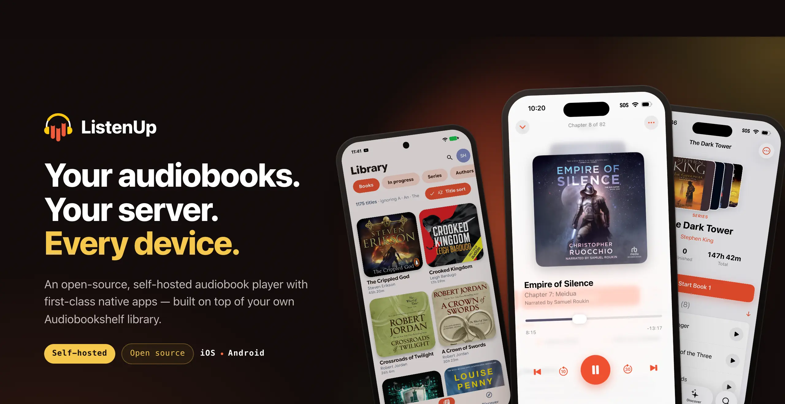
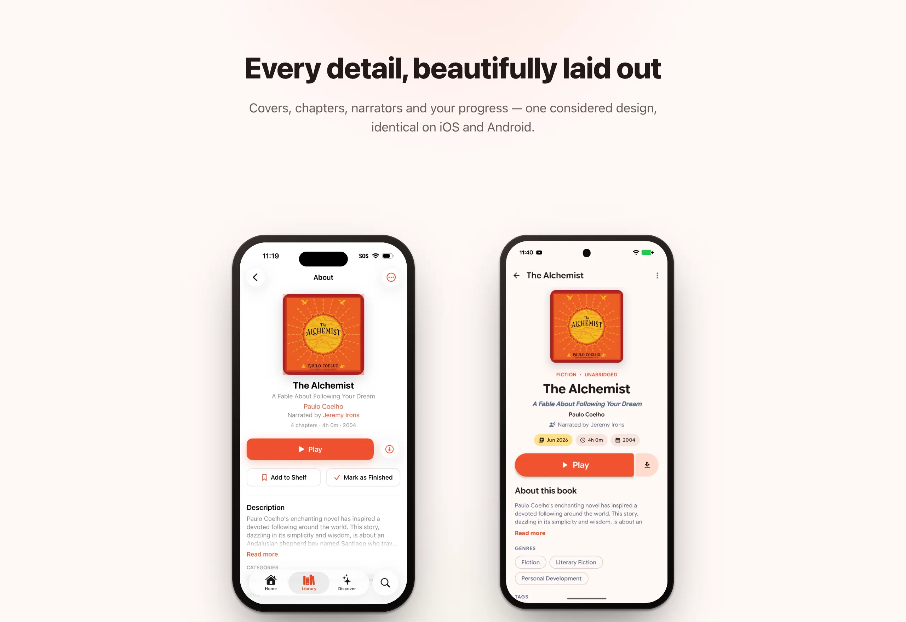

<p align="center">
  <picture>
    <source media="(prefers-color-scheme: dark)" srcset=".github/logo-dark.svg" />
    <source media="(prefers-color-scheme: light)" srcset=".github/logo-light.svg" />
    
  </picture>
</p>

<p align="center">
  <strong>A modern, offline-first audiobook player for Android &amp; iOS</strong>
</p>

<p align="center">
  <a href="https://kotlinlang.org/docs/multiplatform.html"></a>
  <a href="https://developer.android.com"></a>
  <a href="https://developer.apple.com/ios/"></a>
  <a href="https://www.jetbrains.com/compose-multiplatform/"></a>
  
  
</p>



<p align="center">
  ListenUp is a <strong>self-hosted audiobook platform</strong>: native apps for Android and iOS, backed by a
  ListenUp server that you run yourself — included right here in this repository. Built with
  <a href="https://kotlinlang.org/docs/multiplatform.html">Kotlin Multiplatform</a> and designed
  <strong>offline-first</strong> — download your books, sync your progress in real time, and pick up
  where you left off on any device.
</p>


---

## Why ListenUp

- **Truly yours** — self-hosted from the ground up. Your library, your server, your data. No accounts on someone else's cloud.
- **Offline-first** — download once, listen anywhere. The app works with or without a connection, and it never strands you with stale state.
- **Always in sync** — pick up exactly where you left off on any device, in real time.
- **Made for sharing** — activity feeds and leaderboards turn solitary listening into something you share with the people you read alongside.
- **Native & beautiful** — Compose Multiplatform on Android and SwiftUI on iOS, for a fast, modern feel on every device.

## Features

- 🎧 **Audiobook playback** — chapter navigation, sleep timer, variable speed, resume anywhere
- 📥 **Offline First** — books and library content are downloaded for offline playback
- 🔄 **Real-time sync** — progress syncs across your devices instantly via Server-Sent Events (SSE)
- 📚 **Rich library** — browse by collection, contributor, series, or tag
- 📖 **Shelves** — organize your library with your own custom shelves
- 📄 **In-app reading** — built-in reader for PDF & ebook supplements that ship with a title
- 🔍 **Discover** — search and browse your server's catalog, with a local fallback when you're offline
- 👥 **Social** — activity feed and listening leaderboard
- 🛠️ **Admin tools** — manage collections, categories, the import inbox, and backups from the app
- 🎨 **Modern design** — Material 3 Expressive with dynamic color on Android, native SwiftUI and Liquid Glass on iOS

## Platforms

Beta ships on the two platforms below; more are on the way.

| Platform | Status | Audio Engine |
|----------|--------|-------------|
| Android  | ✅ Beta | Media3 / ExoPlayer |
| iOS      | ✅ Beta | AVFoundation |

**In development (not currently shipping):** Desktop (JVM and native macOS) and Android TV both build from this codebase, but the shipping focus is iOS and Android — desktop will be shored up and rebuilt later. Other platforms to follow.

## Getting the Beta

> Public beta links are being set up — check the [Releases](https://github.com/ListenUpApp/ListenUp/releases) page for the latest.

- **iOS** — via TestFlight _(invite coming soon)_
- **Android** — via the Google Play internal track _(invite coming soon)_

### Connecting to a Server

ListenUp is a client-server app — you connect the app to your own [ListenUp server](#run-your-own-server).

1. Launch the app.
2. On the connect screen, enter your server URL (e.g. `http://192.168.1.100:8080`), or let the app discover servers on your local network automatically via mDNS.
3. Sign in, or accept an invite link.

## Run Your Own Server

The ListenUp server lives in this repository as the `:server` module — there's no separate download. To run it from source:

```bash
./gradlew :server:runJvm
```

It serves on port `8080` by default. Point the app at `http://<your-host>:8080` (or rely on mDNS on the same network) and sign in. See the docs site for [installation (Docker)](https://listenup.audio/getting-started/installation/), [configuration](https://listenup.audio/server/configuration/), [backups](https://listenup.audio/server/backups/), and [reverse proxy / HTTPS](https://listenup.audio/server/reverse-proxy/).

### Demo server

Want to try ListenUp without pointing it at a real collection? The build can generate a small synthetic audiobook library and boot a seeded demo server against it (requires `ffmpeg`):

```bash
./gradlew :server:runDemo
```

## Building From Source

For contributors who want to build the apps and server locally.

### Prerequisites

- **JDK 21** (the build pins `jvmToolchain(21)`; Gradle auto-provisions a matching JDK via the Foojay toolchain resolver if you don't have one)
- **Android SDK** with API 33+ (for Android builds) — Android Studio Otter or later recommended
- **Xcode 26** (for iOS builds, macOS only)
- **Native link headers** (only for the server's Linux-native lane, `./gradlew :server:linuxX64Test`): Debian/Ubuntu `libargon2-dev libsqlite3-dev libcurl4-openssl-dev`; Arch `argon2 sqlite curl`. Not needed for the JVM server or the Android app.

### Build & Run

```bash
# Clone
git clone https://github.com/ListenUpApp/ListenUp.git
cd ListenUp

# Android (debug APK)
./gradlew :app:androidApp:assembleDebug

# Server
./gradlew :server:runJvm
```

For iOS, open `iosApp/ListenUp.xcodeproj` in Xcode and run the `ListenUp` scheme against a simulator or device.

## Architecture

```
ListenUp/
├── contract/      # Client↔server contract: @Rpc service interfaces, @Serializable DTOs, error hierarchy
├── app/
│   ├── sharedLogic/   # KMP shared core — domain models, repositories, sync engine, DI, ViewModels (no UI)
│   ├── sharedUI/      # Compose Multiplatform UI (Android + Desktop), organized by feature
│   ├── androidApp/    # Android application entry point
│   └── desktopApp/    # Desktop (JVM) application entry point (in progress)
├── server/        # Self-hostable Ktor server — the hub Android & iOS clients connect to
├── iosApp/        # iOS app — SwiftUI shell over the shared Kotlin core
└── tools/
    ├── build-logic/   # Gradle convention plugins + custom Detekt rules
    └── rpc-guard-ksp/ # KSP processor guarding the RPC boundary
```

ListenUp follows **MVVM** with offline-first data flow and a clean separation between layers:

- **`contract`** is the single source of truth for the client↔server boundary — shared by both sides so a field rename breaks at compile time, not in production.
- **`app/sharedLogic`** holds all business logic, data access, the sync engine, and ViewModels (shared across Android & iOS). The local database is the single source of truth; the UI reads from it, never from the network directly.
- **`app/sharedUI`** holds the Compose Multiplatform screens, organized by feature.
- **`app/androidApp`**, **`iosApp`**, and **`app/desktopApp`** are thin entry points that wire up platform-specific services and launch the shared experience.

## Tech Stack

| Layer | Technology                                                                                    |
|-------|-----------------------------------------------------------------------------------------------|
| Language | [Kotlin 2.4](https://kotlinlang.org/) (Multiplatform)                                         |
| UI | [Compose Multiplatform](https://www.jetbrains.com/compose-multiplatform/), Material 3, Navigation 3 |
| DI | [Koin](https://insert-koin.io/)                                                               |
| Networking | [Ktor](https://ktor.io/) + [kotlinx.rpc](https://github.com/Kotlin/kotlinx-rpc)               |
| Client persistence | [Room](https://developer.android.com/training/data-storage/room) (Multiplatform)              |
| Server persistence | [SQLDelight](https://cashapp.github.io/sqldelight/) + SQLite                                  |
| Image loading | [Coil](https://coil-kt.github.io/coil/)                                                       |
| Playback (Android) | [Media3 / ExoPlayer](https://developer.android.com/media/media3)                              |
| Playback (iOS) | AVFoundation                                                                                  |
| Serialization | [kotlinx.serialization](https://github.com/Kotlin/kotlinx.serialization)                      |
| Code quality | Detekt, Spotless (ktlint)                                                                     |

## License

ListenUp is licensed under the **AGPL-3.0**. See [LICENSE](LICENSE) for the full text.
